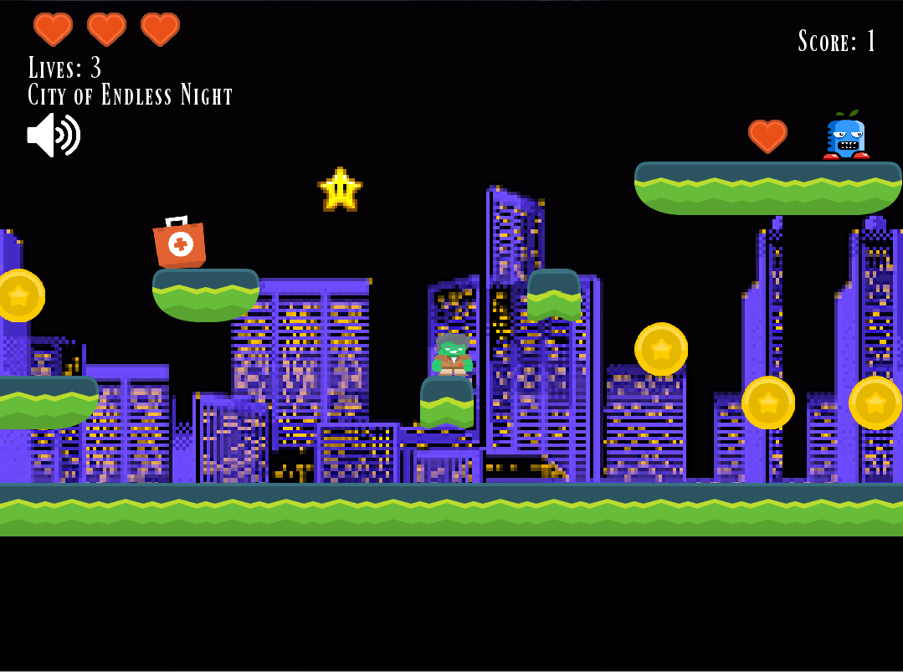
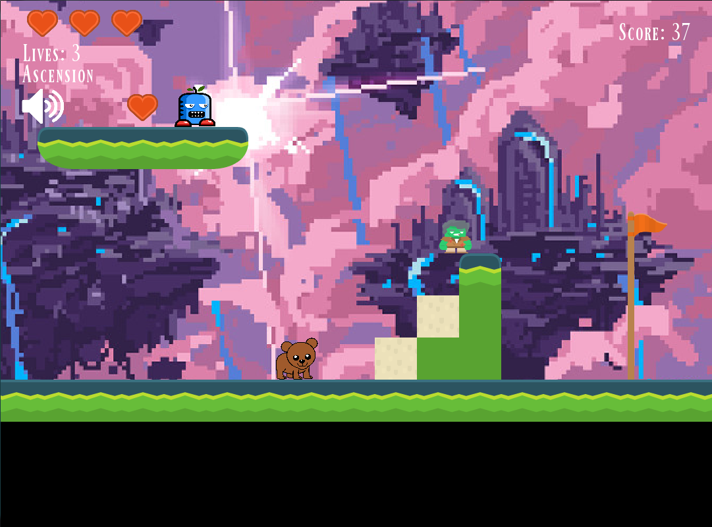

## What You'll Need
### Required
- [Python 3](https://www.python.org/downloads/)
- Pygame: `python3 -m pip install pygame`
https://github.com/Firefox74523/pygame-platformer/archive/master.zip

### Controller Support
- Xbox 360 controller

## Install
Simply download the zip, extract it anywhere, and run `game.py` by either doube clicking, or from terminal by `python3 game.py` or `./game.py`.

## How to play
### Objective
Clear each level by gathering coins, killing enemies by jumping on them, and reaching the flag at the end.

### Controls
#### Keyboard
- A: Move left
- D: Move right
- Space: Jump
- Shift: Sprint
- M: Mute music
- P: Pause game

#### Controller
- A: Jump
- B: Sprint
- Start: Pause
- Left stick: Move left and right

### Items
- Gold coin: Increases coin point by 1.
- Bronze coin: Decreases coin point by 5.
- Star: Temporary invincibility.
- Blue gem: Adds extra life.
- Heart: Adds extra heart.
- Wasp: Getting hit deducts one heart, killing earns 1 generic point.

## Screenshots

